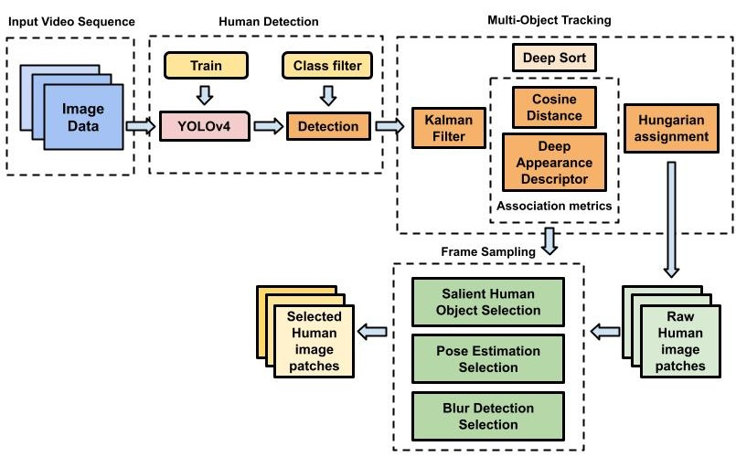

# Yolov4-DeepSORT with Saliant Human Objects Selection (SHOS)

In order to keep track of human existance within a certain area in the workspace, a high performance human detector combined with multi-object tracking algorithm is needed to complete the task. The human detection and tracking system provided in this repo is implemented with Yolov4 in Tensorflow for detection, DeepSORT for tracking, SHOS for sampling, and PySqlite3 for database. Below shows the overall architecture of the system.

Repetitive human image samples is being produced after using the detection-tracking system. To ensure that the human image gallery does not include human image with similar view angle, a sampling method called Saliant Human Objects Selection (SHOS) is implemented to filter out unnecessary repetitive human images. Below shows the flow chart on how the SHOS works.

### References  

   Special thanks to theAIGuysCode, hunglc007 and nwojke for providing the methods for human detection and tracking:
  * [Yolov4-Deepsort implementation](https://github.com/theAIGuysCode/yolov4-deepsort)
  * [tensorflow-yolov4-tflite](https://github.com/hunglc007/tensorflow-yolov4-tflite)
  * [Deep SORT Repository](https://github.com/nwojke/deep_sort)
